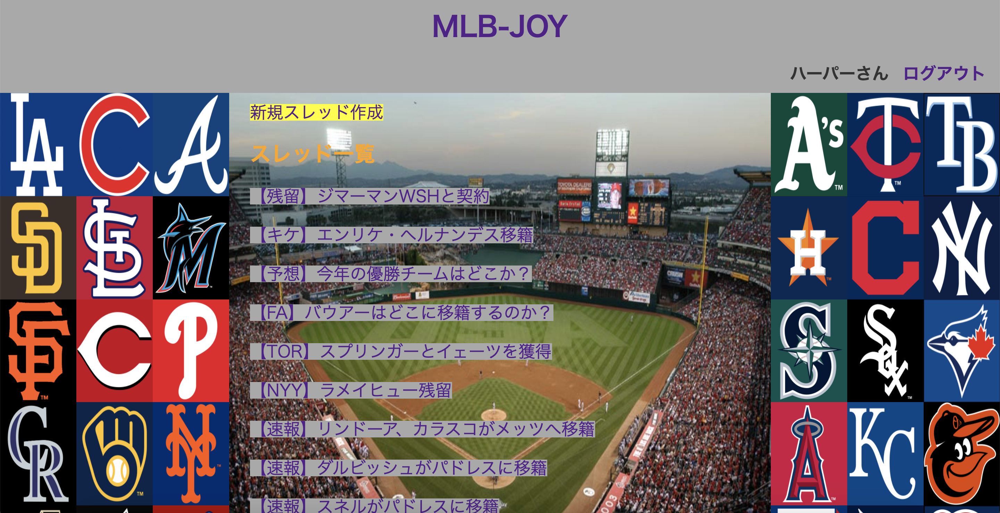
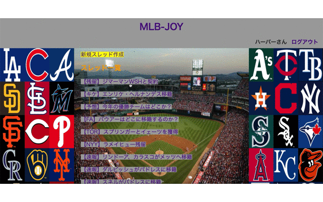
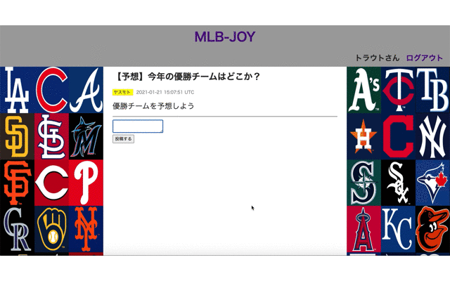

# アプリ名
MLB-JOY

# 概要
メジャーリーグに特化した掲示板のアプリケーションです。 
ログインしたユーザーは、スレッドを作成したりコメントしたりできます。

# 作成理由
私はメジャーリーグが好きで、それに関連する掲示板サイトを見ることがあります。 
そこから掲示板のアプリケーションに興味を持ち、自分で作ってみようと思いました。

# 本番環境
URL 
https://mlb-joy.herokuapp.com/

テストユーザー 
Email：oejgw@boeef 
Password：dDcniRP2EmBhbuu

# アプリケーションの画像・GIF
### トップページ

### スレッド一覧ページ

### スレッド作成

### コメント投稿

# 開発環境

## バックエンド
Ruby on Rails

## フロントエンド
HTML,CSS,JavaScript,Ajax

## データベース
MySQL,SequelPro

## ソース管理
GitHub,GitHubDesktop

## テスト
Rspec

## エディタ
VSCode

# テーブル設計

## users テーブル

| Column   | Type   | Options     |
| -------- | ------ | ----------- |
| nickname | string | null: false |
| email    | string | null: false |
| password | string | null: false |

### Association

- has_many :topic_users
- has_many :topics, through: topic_users
- has_many :posts

## topics テーブル

| Column | Type   | Options     |
| ------ | ------ | ----------- |
| title  | string | null: false |

### Association

- has_many :topic_users
- has_many :users, through: topic_users
- has_many :posts

## topic_users テーブル

| Column | Type       | Options           |
| ------ | ---------- | ----------------- |
| user   | references | foreign_key: true |
| topic  | references | foreign_key: true |

### Association

- belongs_to :user
- belongs_to :topic

## posts テーブル

| Column  | Type       | Options           |
| ------- | ---------- | ----------------- |
| comment | text       | null: false       |
| user    | references | foreign_key: true |
| room    | references | foreign_key: true |

### Association

- belongs_to :user
- belongs_to :topic
